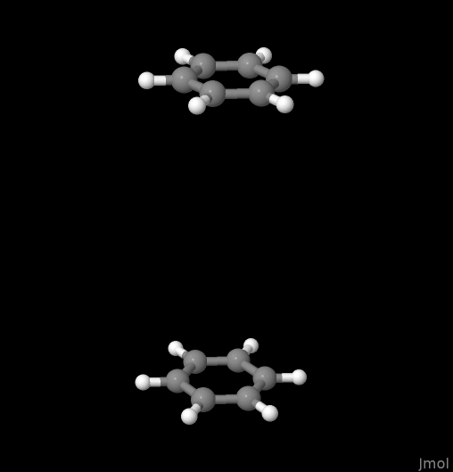
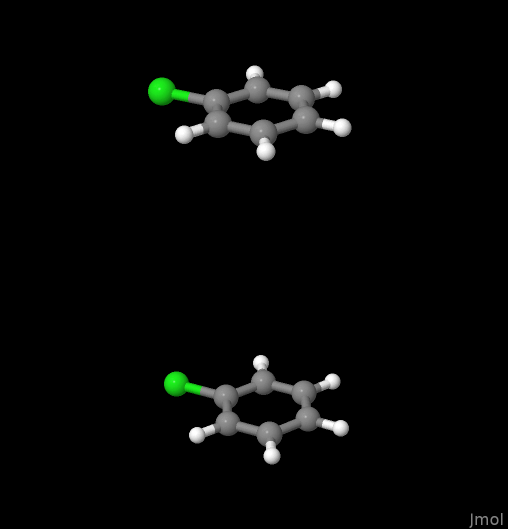
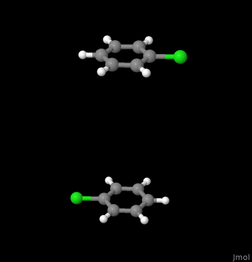

# Building Dimer CAS States, Symmetries, and CI-Vectors from Monomer Orbitals

[](LICENSE)

> **Author**: [Judith M. Leson](https://orcid.org/0009-0002-5627-2673)  
> **Repository**: [jmleson:building_dimer_from_monomer_symmetries_and_civectors](https://github.com/jmleson/building_dimer_from_monomer_symmetries_and_civectors)  
> **Related Work**: Dissertation: *A Quantum-Chemical Analysis of Long-Range Dimer Interactions Arising From Triplet Excited States of Monocyclic Aromatics* (University of Duisburg-Essen, 2026)  
> **Data DOI**: [10.71955/DUEDATA-2026-MR4YY63J](https://doi.org/10.71955/DUEDATA-2026-MR4YY63J)

---


## 📌 Overview

This repository provides **automated Python code** to derive **dimer state symmetries and CI vectors** from **monomer orbital symmetries and occupations**. It enables the systematic correlation between monomer and dimer states in **Complete Active Space (CAS)** calculations.

It is designed for double excitations in **stacked aromatic dimers**, such as:

|                     |                                       D<sub>2h</sub>                                       |                                 C<sub>2v</sub>                                 |                                         D<sub>2h</sub>                                         |
|:--------------------|:------------------------------------------------------------------------------------------:|:------------------------------------------------------------------------------:|:----------------------------------------------------------------------------------------------:|
| Exemplary Molecule: |                          **Benzene (C<sub>6</sub>H<sub>6</sub>)**                          |                **Chlorobenzene (C<sub>6</sub>H<sub>5</sub>Cl)**                |                **Rotated Chlorobenzene (C<sub>6</sub>H<sub>5</sub>Cl rotated)**                |
| Visualization: |  |  |  |


The code systematically constructs **dimer configurations** by combining **monomer states** (ground, triplet, quintet state(e)) and determines:
- The **symmetry of the resulting dimer state**
- The **set of dimer CI vectors** in the CAS(4,4) space
- The **mapping between monomer and dimer states**

This is particularly useful for **interpreting CAS calculations** of excited states in dimers, where the physical meaning of the CI vectors is not immediately obvious.

> ✅ The output is **traceable, step-by-step, and human-readable**, and serves as documentation for the thesis *"A Quantum-Chemical Analysis of Long-Range Dimer Interactions Arising From Triplet Excited States of Monocyclic Aromatics"*.


---
## 🎯 Why This Matters

Quantum-chemical CAS calculations on dimers typically generate a large number of CI vectors.
Without a clear mapping to the  simpler monomer configurations, it becomes difficult to:
- Assign physical meaning to excited states,
- Understand how monomer excitations combine, or
- Validate the correctness of the active space.

This tool **bridges the gap** between monomer properties and dimer wavefunctions enabling **transparent, interpretable, and traceable CAS analysis**.

---
## ✅ Key Features

- **Automated derivation** of dimer state symmetries from monomer states and their orbital symmetries and occupations
- **CI vector generation** based on linear combinations of HOMO-LUMO excited monomer states
- **Support for multiple point groups**:
  - D₂h (e.g., benzene)
  - C₂v (e.g., chlorobenzene)
  - C₂h (e.g., rotated chlorobenzene)
- **Step-by-step LaTeX output** with full derivations
- **Compact and detailed modes** for different use cases
- **Human-readable derivations in compiled PDFs** showing the intermediate steps
- **Enabled comparison to [Molpro](https://www.molpro.net/)  output files** via equation format transformations

---


## 🛠️ How It Works

### Core Idea

A double excited dimer state is built from **two monomer states** (e.g., both excited). 
The symmetry of the dimer state is determined by building all **linear combinations** of the monomer CI vectors and finding the symmetry of the resulting **determinants**.

> ❗ We note that simply taking the direct product of monomer state symmetries **fails to reproduce the true dimer state symmetries**. We need to multiply out the full equations. 

The code:
1. Starts from monomer orbital symmetries and CI vectors for different states
2. Enumerates all possible combinations of monomer states that build a doubly excited dimer state
3. Multiplies out the CI vector combinations and finds independent determinants
4. Computes the symmetry of each determinant and the resulting state
5. Summarizes the results in a LaTeX file

> ✅ The result is a **clear, traceable map** from monomer states to dimer states.
---

### Example: Benzene
As an example, we consider benzene.
As quantum chemical programs typically do not enable D₆h calculation, we perform our considerations in the subgroup D₂h. 

Considering HOMO-LUMO transitions in the monomer leads to a CAS(4,4) space. 
The relevant monomer states and their CI vectors are: 
- $S$: Singlet ground state  

$$
S = \left| (b_{3g}^{\mathsf{l}})^2 (b_{2g}^{\mathsf{l}})^2 (b_{1u}^{\mathsf{l}})^0 (a_{u}^{\mathsf{l}})^0 \right|_{a_g}
$$

- $Q$: Singlet excited state  

$$
 Q = \left| (b_{3g}^{\mathsf{l}})^1 (b_{2g}^{\mathsf{l}})^1 (b_{1u}^{\mathsf{l}})^1 (a_{u}^{\mathsf{l}})^1 \right|_{a_g}
$$

- $i^3 b_{2u}$: Triplet state (antisymmetric combination)     

$$
i^3 b_{2u} = \left| (b_{3g}^{\mathsf{l}})^1 (b_{2g}^{\mathsf{l}})^2 (b_{1u}^{\mathsf{l}})^1 (a_{u}^{\mathsf{l}})^0 \right|_{b_{2u}} - \left| (b_{3g}^{\mathsf{l}})^2 (b_{2g}^{\mathsf{l}})^1 (b_{1u}^{\mathsf{l}})^0 (a_{u}^{\mathsf{l}})^1 \right|_{b_{2u}}
$$

- $e^3 b_{2u}$: Triplet state (symmetric combination)    

$$e^3 b_{2u} = \left| (b_{3g}^{\mathsf{l}})^1 (b_{2g}^{\mathsf{l}})^2 (b_{1u}^{\mathsf{l}})^1 (a_{u}^{\mathsf{l}})^0 \right|_{b_{2u}} + \left| (b_{3g}^{\mathsf{l}})^2 (b_{2g}^{\mathsf{l}})^1 (b_{1u}^{\mathsf{l}})^0 (a_{u}^{\mathsf{l}})^1 \right|_{b_{2u}}$$

- $i^3 b_{3u}$: Triplet state (antisymmetric)  

$$i^3 b_{3u} = \left| (b_{3g}^{\mathsf{l}})^2 (b_{2g}^{\mathsf{l}})^1 (b_{1u}^{\mathsf{l}})^1 (a_{u}^{\mathsf{l}})^0 \right|_{b_{3u}} - \left| (b_{3g}^{\mathsf{l}})^1 (b_{2g}^{\mathsf{l}})^2 (b_{1u}^{\mathsf{l}})^0 (a_{u}^{\mathsf{l}})^1 \right|_{b_{3u}}$$

- $e^3 b_{3u}$: Triplet state (symmetric)

$$e^3 b_{3u} = \left| (b_{3g}^{\mathsf{l}})^2 (b_{2g}^{\mathsf{l}})^1 (b_{1u}^{\mathsf{l}})^1 (a_{u}^{\mathsf{l}})^0 \right|_{b_{3u}} + \left| (b_{3g}^{\mathsf{l}})^1 (b_{2g}^{\mathsf{l}})^2 (b_{1u}^{\mathsf{l}})^0 (a_{u}^{\mathsf{l}})^1 \right|_{b_{3u}}$$


Building all linear combinations, one finds that the dimer state formed from a monomer in the ground state $S$ and one in the quintet state $Q$ has the form:  

$$
S \otimes Q + Q \otimes S \quad = 
$$  

$$
+2 \cdot \left|\underbrace{(b_{2u})^{2}(b_{3g})^{1}(b_{3u})^{2}(b_{2g})^{1}(a_{g})^{0}(b_{1u})^{1}(b_{1g})^{0}(a_{u})^{1}}_{a_{g}}\right| +2 \cdot \left|\underbrace{(b_{2u})^{2}(b_{3g})^{1}(b_{3u})^{2}(b_{2g})^{1}(a_{g})^{1}(b_{1u})^{0}(b_{1g})^{1}(a_{u})^{0}}_{a_{g}}\right| 
$$

$$
+2 \cdot \left|\underbrace{(b_{2u})^{2}(b_{3g})^{1}(b_{3u})^{1}(b_{2g})^{2}(a_{g})^{0}(b_{1u})^{1}(b_{1g})^{1}(a_{u})^{0}}_{a_{g}}\right| +2 \cdot \left|\underbrace{(b_{2u})^{2}(b_{3g})^{1}(b_{3u})^{1}(b_{2g})^{2}(a_{g})^{1}(b_{1u})^{0}(b_{1g})^{0}(a_{u})^{1}}_{a_{g}}\right| 
$$

$$
+2 \cdot \left|\underbrace{(b_{2u})^{1}(b_{3g})^{2}(b_{3u})^{2}(b_{2g})^{1}(a_{g})^{0}(b_{1u})^{1}(b_{1g})^{1}(a_{u})^{0}}_{a_{g}}\right| +2 \cdot \left|\underbrace{(b_{2u})^{1}(b_{3g})^{2}(b_{3u})^{2}(b_{2g})^{1}(a_{g})^{1}(b_{1u})^{0}(b_{1g})^{0}(a_{u})^{1}}_{a_{g}}\right| 
$$

$$
+2 \cdot \left|\underbrace{(b_{2u})^{1}(b_{3g})^{2}(b_{3u})^{1}(b_{2g})^{2}(a_{g})^{0}(b_{1u})^{1}(b_{1g})^{0}(a_{u})^{1}}_{a_{g}}\right| +2 \cdot \left|\underbrace{(b_{2u})^{1}(b_{3g})^{2}(b_{3u})^{1}(b_{2g})^{2}(a_{g})^{1}(b_{1u})^{0}(b_{1g})^{1}(a_{u})^{0}}_{a_{g}}\right|
$$  

while the negative linear combination $S \otimes Q - Q \otimes S$ falls into $b_{1u}$ symmetry. 


## 🔧 How to Use
### 📂 Structure
- `requirements.txt`: Needed python libraries
- `src`: Folder for source files
- `src/run.py`: Main script that generates correlations between monomer and dimer states for C6H6, C6H5Cl, and C6H5Cl rotated
- `resulting_tex_files/`: Folder for LaTeX compilation files
- `resulting_tex_files/run.sh <filename>`: Compiles `.tex` files into PDFs (output in `resulting_tex_files/build/`)


### 📦 Dependencies

This project requires:
- `itertools` 
- `re`
- `unittest` 

Install with:
```bash
python3 -m venv .venv
source .venv/bin/activate
pip install -r requirements.txt
```


### 💻 Running the Code
Exemplary use of the code is given in `src/run.py` for different molecular systems.

In general, the results of a different order for a tensor can be gained by calling `get_summarizing_latex_file`.
For instance: 
```python
from src.symmetries.CI_ORDERING import CI_ORDERING
from src.symmetries.Molecule import Molecule
from src.latex.pdf_summary.get_summarizing_latex_file import get_summarizing_latex_file

order = CI_ORDERING.molpro

get_summarizing_latex_file(Molecule.C6H6, ordering=order, detailed=False)
```

The detailed parameter determines whether the generated LaTeX file includes a full, step-by-step derivation or omits intermediate steps to produce a more concise and slimmer PDF version. 

The order parameter specifies the orbital ordering convention to use. It can be set to:
-   `CI_ORDERING.my`: the ordering used in the dissertation (see above)
-   `CI_ORDERING.molpro`: the orbital ordering convention used by the [Molpro quantum chemistry package](https://www.molpro.net/) 


